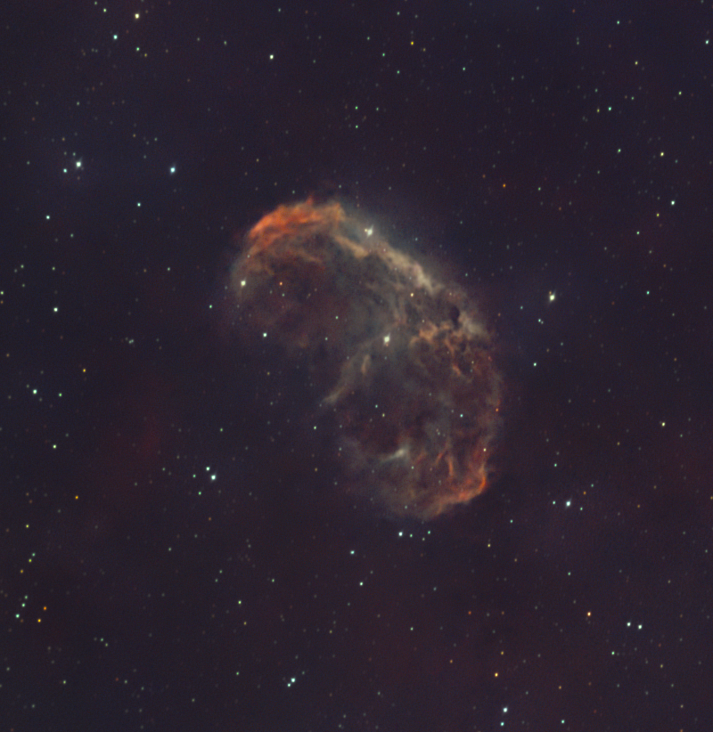
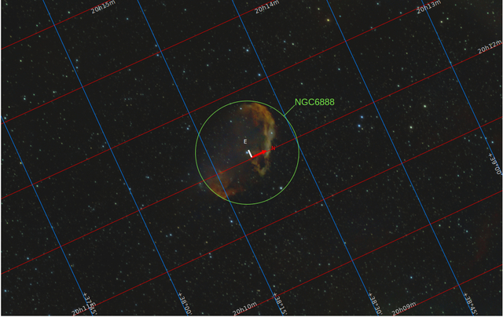
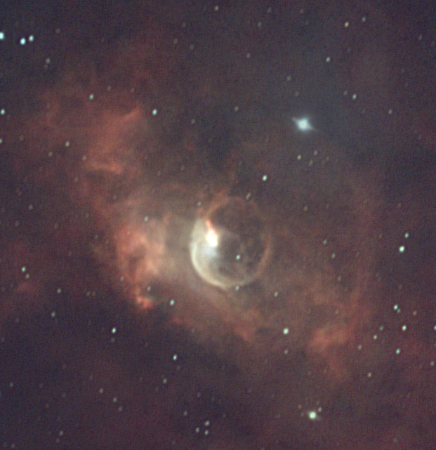
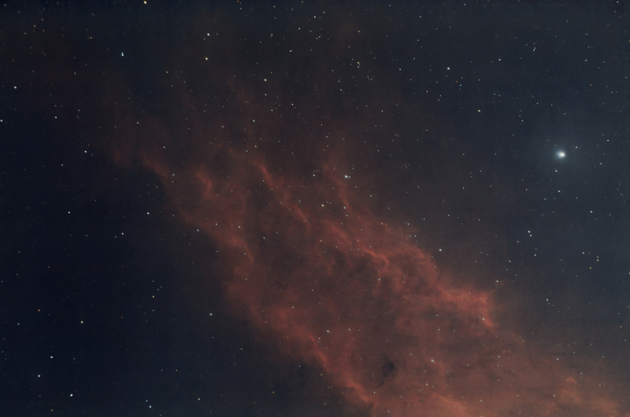
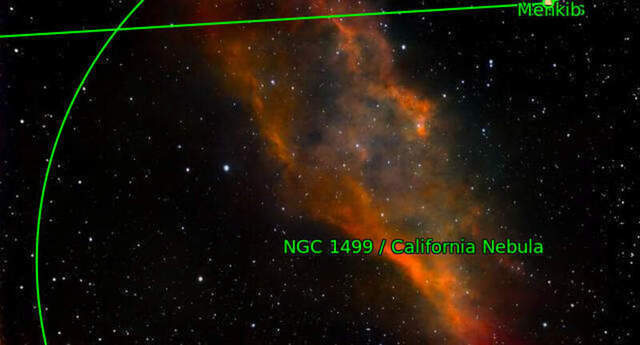

# Wolf-Rayet Nebulae

[Star nurseries](./Star_Nurseries.md) are complex clouds of gas and dust within which there are **many** young, but very hot, baby stars, but these Wolf-Rayet nebulae have been carved by just a **single**, incredibly powerful star whose strong stellar wind literally blows the matter  that surrounds it. Due to the extreme power of these stellar structures, they produce, perhaps, under my opinion, the most eyecatching and intriguing pictures of the night sky.

[Crescent Nebula](./Crescent_Nebula.md)

This is the most relevant WR Nebulae. It lies near the star [Sadr](./Sadr_Star.md) at the very core of the Cygnus constellation.

This beautiful shock wave is produced by one of the most energetic known stars, that right in the middle of the green circle. Its only name is a cold denomination of WR136. It is a star 500.000 times brighter than our sun, and a surface temperature above 70.000ºK. One upon a time it used to be a red giant star, like [Betelegeuse](./Betelgeuse_Star.md) and expelled a massive cloud of material, but then, instead of collapsing as a supernova, it turned into a Wolf-Rayet star with a powerful stellar wind (due to its 70.000ºK) that literally pushes all this cloud away from the star.

[Bubble Nebula](./Bubble_Nebula.md)

This is one of the most misterious celestial bodies that needs to be captured with specific equipment.

Its central star, named SAO 20575, a rare star with an estimated surface temperature of nearly 40.000ºK, that produces a stellar wind with a supersonic speed of 1.800-2.500 km/s. This massive stellar wind pushes the cloud of dust and gas around the star outwards in a shock wave, slightly ellyptical, that reflects the surrounding light, producing this signature appearance of a soap bubble.

[California Nebula](./California_Nebula.md)

In this case, the super energetic star to the right, Menkib, in the constellation of Perseus, with 30 times the mass of our sun and 35.000ºK of surface temperature, ionizes a cloud of pure hydrogen and bends it due to its strong stellar winds.
