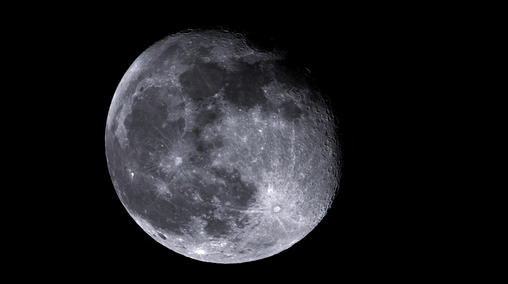

#  The Moon

The Moon is Earth's only natural satellite. It orbits at an average distance of 384,400 km (238,900 mi), about 30 times the diameter of Earth. Tidal forces between Earth and the Moon have synchronized the Moon's orbital period (lunar month) with its rotation period (lunar day) at 29.5 Earth days, causing the same side of the Moon to always face Earth. The Moon's gravitational pull—and, to a lesser extent, the Sun's—are the main drivers of Earth's tides.

[ Read more](https://en.wikipedia.org/wiki/Moon)
## Plate solving 

| Globe | Close | Very close |
| ----- | ----- | ----- |

## Gallery
 

 

