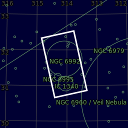

#  Veil Nebula

The Veil Nebula is a cloud of heated and ionized gas and dust in the constellation Cygnus.[4] It constitutes the visible portions of the Cygnus Loop,[5] a supernova remnant, many portions of which have acquired their own individual names and catalogue identifiers. The source supernova was a star 20 times more massive than the Sun which exploded between 10,000 and 20,000 years ago.[2] At the time of the explosion, the supernova would have appeared brighter than Venus in the sky, and visible in the daytime.[6] The remnants have since expanded to cover an area of the sky roughly 3 degrees in diameter (about 6 times the diameter, and 36 times the area, of the full Moon).[4] While previous distance estimates have ranged from 1200 to 5800 light-years, a recent determination of 2400 light-years is based on direct astrometric measurements.[2] (The distance estimates affect also the estimates of size and age.) The Hubble Space Telescope captured several images of the nebula. The analysis of the emissions from the nebula indicates the presence of oxygen, sulfur, and hydrogen.[7] The Cygnus Loop is also a strong emitter of radio waves and x-rays.[8]

[ Read more](https://en.wikipedia.org/wiki/Veil_Nebula)
## Plate solving 

| Globe | Close | Very close |
| ----- | ----- | ----- |
| | | |

## Gallery
 

 

 

 

 

 

