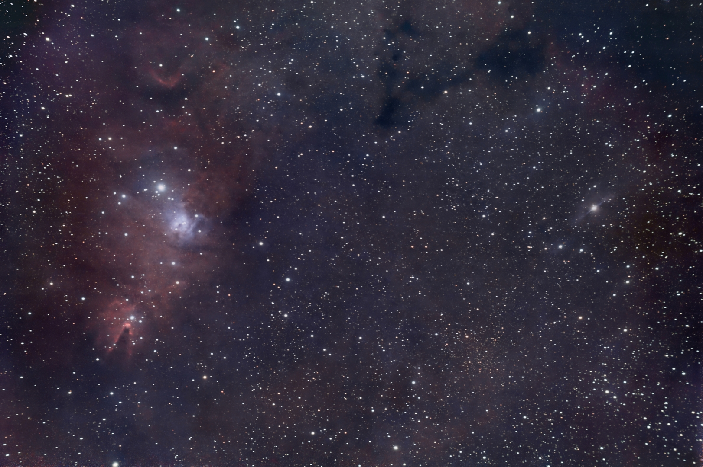
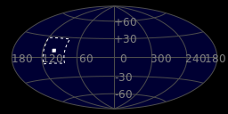
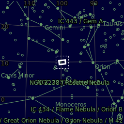
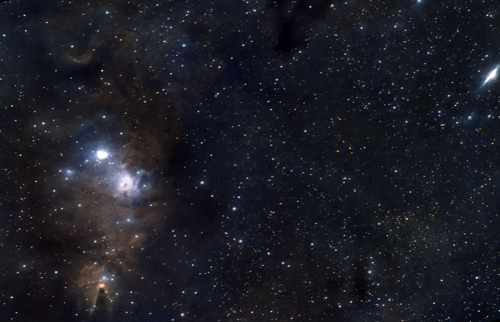

#  XTMAS Tree Nebula

The Cone Nebula is an H II region in the constellation of Monoceros. It was discovered by William Herschel on December 26, 1785, at which time he designated it H V.27. The nebula is located about 830 parsecs or 2,700 light-years from Earth. The Cone Nebula forms part of the nebulosity surrounding the Christmas Tree Cluster. The designation of NGC 2264 in the New General Catalogue refers to both objects and not the nebula alone.

[ Read more](https://en.wikipedia.org/wiki/Cone_Nebula)
## Plate solving 

| Globe | Close | Very close |
| ----- | ----- | ----- |
| | | |

## Gallery
 

 

 

